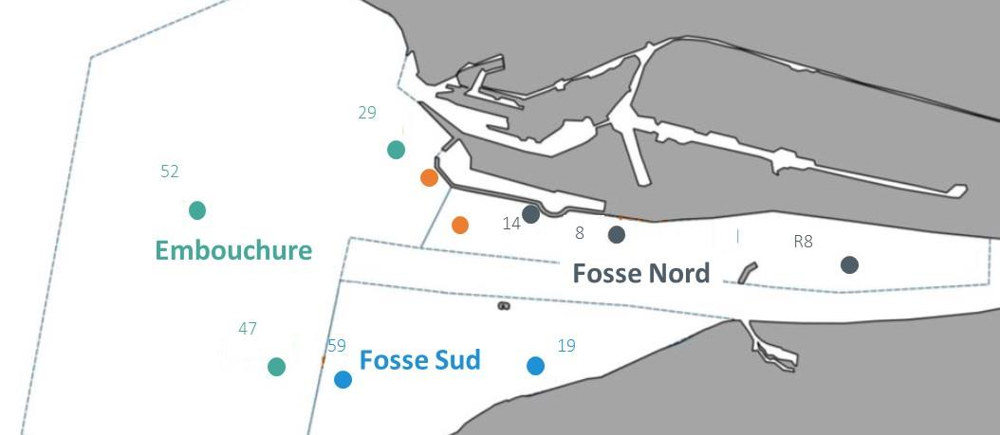

```{r setup, include=FALSE}
knitr::opts_chunk$set(
  echo = FALSE,
  warning = FALSE,
  message = FALSE,
  error = FALSE,
  fig.width = 7,
  fig.height = 5,
  out.width = "95%"
)
library(chopin.data)
library(officer)
library(tidyverse)
library(flextable)
```

##### Abstract

Estuarine nurseries provide essential habitats for the early life stages of numerous marine fish species, but their ecological functioning can be affected by exposure to multiple chemical contaminants. Understanding contaminant accumulation and transfer within these habitats requires integrated observations of environmental contamination, benthic organisms, fish diet and biological responses. However, such data are often fragmented across environmental compartments and disciplinary approaches, limiting their reuse for trophic and ecotoxicological investigations.

Here, we present an integrated dataset assembled from the CHOPIN project (*Contaminants organoHalogénés histOriques et d’intérêt émergent : Présence et transfert vers la sole commune – Impact de la contamination sur la Nourricerie et conséquences sur la population*), conducted in the Seine estuary, France. The dataset characterizes contamination by polychlorinated biphenyls (PCBs), hexabromocyclododecane (HBCDD) isomers and per- and polyfluoroalkyl substances (PFAS) across surface sediments, benthic macrofauna and common sole (*Solea solea*).

The database combines contaminant concentrations and chemical reference information with sediment characteristics, benthic functional traits, carbon and nitrogen stable isotope signatures, juvenile sole stomach contents, fish morphometric measurements and biological biomarkers. Contaminant measurements in age-2 sole additionally distinguish liver, gonads and the remaining body compartment, enabling the investigation of tissue-specific accumulation and contaminant distribution.

The data are distributed as documented, directly usable R objects through the CHOPIN data package, together with preparation scripts and supporting documentation. This resource facilitates reproducible investigations of contaminant occurrence, bioaccumulation, trophic transfer, fish diet and biological responses in estuarine nursery habitats.


##### keywords

Seine estuary; common sole; benthic food web; PCB; PFAS; HBCDD; stable isotopes; bioaccumulation; ecotoxicology; R data package.

##### Article type

Data Descriptor

##### Target journal

Scientific Data

\newpage


## Background & Summary

Coastal and estuarine habitats support the juvenile stages of numerous marine fish species and contribute to the renewal of exploited populations. These nursery habitats are subject to multiple environmental pressures, including habitat modification and chemical contamination, which may affect the growth, survival and subsequent contribution of juvenile fish to adult populations.

The Seine estuary, located in northwestern France, provides nursery habitats for the common sole (*Solea solea*), a commercially important flatfish in the eastern English Channel. At the same time, the estuary receives contaminants originating from its catchment and local activities. Sediments can act as reservoirs of persistent organic contaminants, providing potential exposure pathways for benthic organisms and their predators.

The CHOPIN project was established to investigate the occurrence, accumulation and transfer of historical and emerging organohalogenated contaminants within the Seine estuary common sole nursery. Three contaminant families were considered: polychlorinated biphenyls (PCBs), hexabromocyclododecane (HBCDD) isomers and per- and polyfluoroalkyl substances (PFAS). The project also investigated biological responses in juvenile and subadult soles and explored the possible implications of nursery contamination for the population of common sole in the eastern English Channel.

The project integrated measurements from several environmental and biological compartments. Sediment sampling characterized the environmental contamination of nursery habitats, while contaminant analyses of benthic macrofauna provided information on potential dietary exposure. Measurements in common sole enabled comparisons among age classes and, for older individuals, among body compartments. Stable isotope signatures and stomach content analyses complemented chemical measurements by describing trophic relationships and prey consumption.

These observations provide several complementary perspectives on contaminant dynamics. Chemical concentrations can be used to characterize exposure and accumulation across compartments, while dietary information and stable isotope signatures support the investigation of trophic transfer. Tissue-specific measurements provide information on contaminant distribution within individual fish, and biological measurements allow associations between contaminant exposure and organism condition to be explored.

The present publication describes the data resources assembled from the CHOPIN project and distributed through a dedicated R package. Its purpose is to document their origin, structure, analytical scope, quality-control procedures and potential applications, rather than to test individual hypotheses regarding contaminant biomagnification or effects on fish populations.

The package brings together environmental, trophic, chemical and biological observations in a documented format, enabling researchers to access the different components of the dataset and combine them for further analyses.

## Methods

### Study area

The study was conducted during several sampling campaigns in 2017 and 2018 in the lower Seine estuary and its adjacent marine environment in Normandy, France. The sampling design distinguished three principal estuarine sectors: the northern pit (*Fosse Nord*), the southern pit (*Fosse Sud*) and the estuary mouth (*Embouchure*) (see Fig. \@ref(fig:fig-map)).

These sectors encompass spatial variation in hydrosedimentary conditions and benthic habitats. Sediment sampling focused on sandy to muddy substrates suitable for juvenile common sole and potentially favourable to the accumulation of sediment-associated contaminants.

The CHOPIN sampling design also included additional locations for specific biological measurements, including the navigation channel and the area offshore from Octeville for the study of older sole.

```{r fig-map, fig.cap="Map of the Seine estuary showing the sampling sectors and stations used for sediment sampling.", out.width="100%", fig.show='hold'}

```


### Sediment sampling and characterization

Surface sediment was collected to characterize contaminant concentrations and selected physicochemical properties.

Surface sediment samples were collected using a grab sampler at eight stations distributed across three sectors of the estuary: Fosse Nord (FN), Fosse Sud (FS), and Embouchure (Emb), during three field campaigns (June and October 2017 and October 2018).

The sediment dataset includes sampling metadata and physicochemical characteristics, including grain-size distribution, organic carbon and nitrogen contents, carbon-to-nitrogen ratio, porosity and water content, according to the availability of measurements.

Grain-size characteristics and organic carbon content provide contextual information for interpreting the occurrence and distribution of sediment-associated contaminants.

Individual contaminant concentrations are expressed relative to sediment dry weight. Organic carbon-normalized concentrations are also provided, together with summed concentrations and the relative contributions of individual compounds to their respective contaminant families.

The exact analytical definitions, measurement units and availability of each sediment variable are described in the package documentation.

### Benthic macrofauna sampling and characterization

Benthic macrofauna was collected during the sediment sampling campaigns. The sampling targeted organisms potentially contributing to the diet of juvenile common sole, while also accounting for their occurrence in the study area and the amount of biological material required for chemical analysis.


Species selection was informed by previous knowledge of common sole diet, the expected occurrence of benthic organisms in the study area and the quantity of biological material required for chemical analyses.

The targeted assemblage comprised 16 benthic species belonging to three broad taxonomic groups: bivalves, polychaetes and crustaceans.

Benthic samples were characterized using taxonomic identification, collection metadata, dry matter content and lipid content, where available. Carbon and nitrogen stable isotope signatures were also measured for selected samples.

Additional biological trait information was assembled into a taxonomic reference table, including broad taxonomic group, feeding mode and mobility category.

These complementary data enable contaminant concentrations to be examined in relation to benthic taxonomy, trophic characteristics and potential prey identity.

### Common sole sampling and biological characterization

Common sole sampling covered several age classes. Age-0 fish (G0) were collected in June and October 2017, age-1 fish (G1) in autumn 2017 and 2018, and age-2 fish (G2) in autumn 2018.

Common sole were analysed according to their age class and the biological material available for chemical analysis.

Age-0 sole were pooled by sampling period and sector to obtain sufficient material for contaminant measurements. Mean individual length and mass were recorded for these pooled samples.

Age-1 sole were analysed individually using whole-body or eviscerated whole-body material, according to the analytical dataset and sampling protocol.

For age-2 sole, separate analyses were conducted on the liver, gonads and remaining body compartment. The study of these compartments was designed to characterize tissue-specific contaminant distribution, including potential accumulation in reproductive organs.

Morphometric characteristics, dry matter content and lipid content were recorded where available. The tissue-specific measurements can also be used to reconstruct contaminant amounts across the analysed body compartments.

The dataset also includes complementary stomach content and stable isotope measurements acquired through the CAPES and CHOPIN projects.


### Chemical analyses

The CHOPIN project targeted three families of organohalogenated contaminants.

The PCB dataset includes 19 congeners selected for chemical analysis. The HBCDD dataset includes the alpha, beta and gamma isomers. The PFAS dataset covers several chemical subclasses, including perfluoroalkyl carboxylic acids, perfluoroalkyl sulfonates, sulfonamide-related compounds and selected alternative or precursor substances.

Contaminant concentrations are provided for sediment and biological samples using the appropriate measurement basis. Dry-weight concentrations are available across the main analytical datasets. Additional organic carbon-normalized sediment concentrations and lipid-normalized biological concentrations are provided for selected compound families (PCBs and HBCDD isomers).

A chemical reference table documents compound identifiers, chemical families and subclasses, selected physicochemical properties and available analytical detection and quantification limits.

[**To complete:** Specify the laboratory analytical procedures used for each chemical family and sample matrix, including extraction, purification, instrumental analysis, calibration, blank correction, internal standards, recoveries and treatment of values below the detection or quantification limits.]

### Stable isotope measurements

Carbon and nitrogen stable isotope signatures were measured in selected benthic organisms and common sole from the CAPES and CHOPIN projects.

The isotope dataset includes carbon and nitrogen isotope values, associated elemental composition measurements, taxonomic information, sampling metadata and selected biological characteristics.

Carbon and nitrogen stable isotope signatures can be used to investigate variation in trophic resource use and relative trophic position among organisms.

[**To complete:** Specify tissue preparation, lipid treatment if applicable, analytical instrumentation, isotope reference standards, measurement precision and any correction or normalization procedures.]

### Stomach content analysis

Digestive tract contents were examined to identify prey consumed by juvenile common sole and characterize their relative contribution to the diet.

The stomach content dataset includes fish identifiers and biological characteristics, taxonomic identification of prey and other recorded material, prey counts, digestive compartment information and degradation-stage observations.

Prey abundance is recorded separately for the stomach and intestine, allowing diet composition to be examined using either compartment or the complete digestive tract.

A supplementary taxonomic classification table provides the hierarchical classification of prey taxa, including organisms identified only to genus or higher taxonomic levels.

[**To complete:** Describe the dissection procedure, prey identification protocol, counting rules for fragmented organisms and criteria used to assign degradation stages.]

### Biological condition, histology and biomarkers

Biological measurements in common sole included morphometric characteristics, liver and gonad masses, hepatosomatic and gonadosomatic indices, histological observations and selected biomarkers.

Acetylcholinesterase (AChE) activity was measured as a biomarker related to neurotoxicity, and ethoxyresorufin-O-deethylase (EROD) activity as an indicator of biotransformation activity.

DNA damage was assessed using the comet assay, with measurements expressed as Olive tail moment and percentage of DNA in the comet tail. Additional biological measurements included micronucleus observations and vitellogenin.

The dataset records AChE activity in µmol min⁻¹ mg⁻¹ and EROD activity in pmol min⁻¹ mg⁻¹. Other analytical units and histological classification codes are documented where available.

[**To complete:** Describe the corresponding laboratory protocols, tissue preparation, analytical replication and quality-control procedures.]

## Data Records

The data are distributed through the R package **chopin.data**, which provides documented datasets and supporting reference tables.

The package is organized into several complementary data domains.

| Dataset            | Description                                                                                   |
| ------------------ | --------------------------------------------------------------------------------------------- |
| `sed_contam`       | Sediment characteristics and contaminant concentrations                                       |
| `benthos_contam`   | Benthic macrofauna characteristics and contaminant concentrations                             |
| `soles_contam`     | Common sole contaminant concentrations, including tissue-specific measurements in G2 fish     |
| `soles_stomach`    | Juvenile common sole digestive tract contents and prey observations                           |
| `isotopes`         | Carbon and nitrogen stable isotope signatures of benthos and sole                             |
| `soles_biomarkers` | Common sole morphometric measurements, somatic indices, histology and biomarkers              |
| `contam_info`      | Chemical identifiers, compound families, physicochemical properties and analytical parameters |
| `benthos_info`     | Benthic taxonomic and functional trait reference table                                        |
| `soles_info`       | Common sole taxonomic and functional trait reference table                                    |
| `species_classif`  | Taxonomic classification of organisms identified in sole digestive tract contents             |

Additional reference vectors are provided to facilitate the selection of contaminants and chemical subclasses in R analyses.

Each dataset is distributed as a directly accessible R object. Variable definitions, measurement units and examples of use are provided through the package documentation.

Several tables contain complementary observations referring to the same sampling locations, organisms or chemical compounds. The variables used to link these tables include sample identifiers, scientific names and chemical identifiers, as appropriate.

The datasets retain distinctions among individual fish, pooled biological samples and tissue-specific observations. These differences must be considered when combining tables or interpreting sample sizes.

**Data and code availability:** [https://github.com/FlorenceMounier/chopin.data]


## Technical Validation

### Analytical quality control

[This section requires the analytical quality-control information associated with each compound family and biological matrix.]

The chemical reference table contains available limits of detection and quantification. These analytical thresholds should be considered when interpreting low contaminant concentrations and measurements below the quantification limit.

The procedures applied to non-detected compounds, censored values and missing measurements must be documented explicitly for each data table.


### Reproducibility of data preparation

[Describe the data preparation scripts supplied with the package, their input files and the transformations applied to the original CHOPIN database.]

The package documentation and preparation scripts should allow users to identify the origin of each distributed dataset and reproduce the transformation of the original analytical records into the published R objects.

## Usage Notes

The integrated dataset can support investigations of contaminant occurrence across environmental compartments, chemical accumulation in benthic organisms, trophic exposure of juvenile common sole and variation in contaminant distribution among fish tissues.

The combination of stomach content and stable isotope information enables comparisons between observed diet composition and broader trophic patterns. Together with contaminant concentrations, these data can support the estimation of sediment-to-biota accumulation factors, biomagnification factors and trophic magnification factors, subject to the assumptions of each approach.

The tissue-specific measurements from G2 sole provide opportunities to examine contaminant partitioning among liver, gonads and remaining body tissues. The biological measurements may also support exploratory analyses of associations between contaminant exposure, fish condition and biomarker responses.

Several limitations should be considered when reusing the data. Sampling coverage differs among compartments, years, sectors, species and fish age classes. Not all chemical compounds were analysed in every biological matrix. Pooled samples and tissue-specific measurements do not constitute independent observations of individual fish.

The dataset is therefore suited to analyses that explicitly account for sampling structure, measurement availability and the analytical characteristics of each contaminant family.

## References

[Insert the original CHOPIN project report and the methodological references relevant to sampling, analytical chemistry, stable isotope analysis, stomach content identification and biomarker measurements.]

## Acknowledgements

[To be completed with the participating institutions, laboratories, technical staff, funders and contributors to data collection and preparation.]

## Author Contributions

[To be completed according to the actual contributions to field sampling, laboratory analyses, database construction, software development, validation and manuscript preparation.]

## Competing Interests

The authors declare no competing interests.
